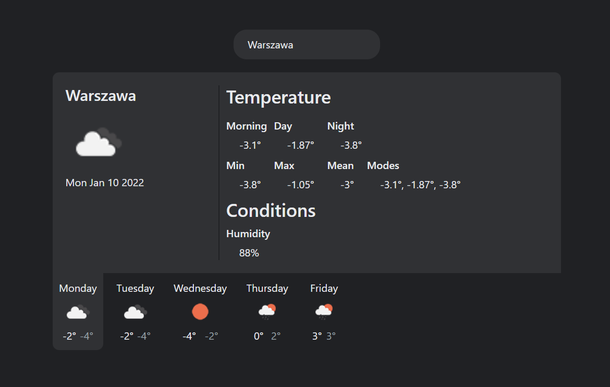

# Weather-app

Simple application displaying 5-day weather data for given city.\
Based on https://openweathermap.org/api/one-call-api

## Notes

Mode and mean temperatures are calculated only from morning, day and night temperatures.

## How to use?

1. Run `yarn install` in the root directory
2. Run `yarn start` in the root directory
3. Go to `localhost:3000`
4. Type in city name that you want to see forecast for (default value is `Warszawa`)

## Issues

The issue with memory limit can occur caused by loading huge JSON file of available cities data. If application crash, please feel free to restart it. : )

## Available Scripts

In the project directory, you can run:

### `yarn start`

Runs the app in the development mode.\
Open [http://localhost:3000](http://localhost:3000) to view it in the browser.

The page will reload if you make edits.\
You will also see any lint errors in the console.

### `yarn test`

Launches the test runner in the interactive watch mode.\
See the section about [running tests](https://facebook.github.io/create-react-app/docs/running-tests) for more information.
